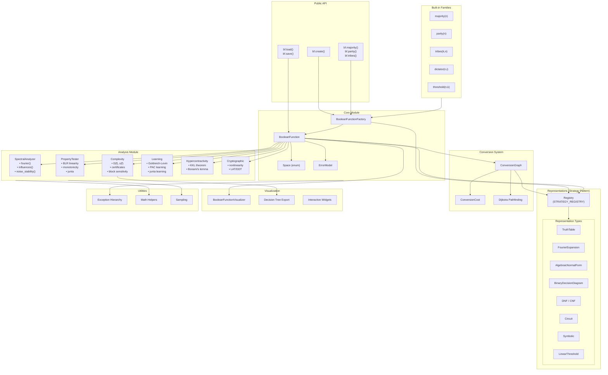

# Architecture

BooFun is a modular Boolean function analysis library designed around lazy evaluation, pluggable representations, and mathematical rigor. This document describes the high-level architecture and key design decisions.

## Architecture Diagram



## Component Overview

### Public API (`api.py`, `__init__.py`)

The public API provides a unified entry point for users:

```python
import boofun as bf

# All roads lead through bf.create()
f = bf.create([0, 1, 1, 0])           # Truth table
f = bf.create(lambda x: x[0] ^ x[1], n=2)  # Callable
f = bf.create("x0 & x1", n=2)         # Symbolic
f = bf.majority(5)                     # Built-in
```

**Design decision**: A single `create()` function with type detection simplifies the API. Storage hints (`storage='packed'`, `'sparse'`, `'lazy'`) allow users to optimize without understanding internals.

### Core Module (`core/`)

#### BooleanFunction (`base.py`)

The central class representing a Boolean function. Key features:

- **Lazy evaluation**: Representations are computed on-demand
- **Multiple representations**: A function can have truth table, Fourier, ANF simultaneously
- **Callable interface**: `f([1,0,1])` or `f(5)` both work
- **Operator overloading**: `f & g`, `f | g`, `~f`, `f ^ g`

```python
class BooleanFunction:
    def __init__(self, space, error_model, ...):
        self.representations: Dict[str, Any] = {}  # Lazy cache
        self.n_vars: int
        self.space: Space
```

#### Factory (`factory.py`)

Handles creation from various input types:

- Auto-detects input type (list, callable, string, file path)
- Delegates to appropriate `from_*` methods
- Validates inputs and sets `n_vars`

#### Space (`spaces.py`)

Defines the mathematical domain/codomain:

```python
class Space(Enum):
    BOOLEAN_CUBE = "boolean_cube"      # {0,1}^n → {0,1}
    PLUS_MINUS_CUBE = "plus_minus_cube" # {-1,+1}^n → {-1,+1}
    REAL = "real"                       # For Fourier coefficients
```

### Representations (`core/representations/`)

Uses the **Strategy Pattern** for pluggable representations.

#### Registry (`registry.py`)

```python
STRATEGY_REGISTRY: Dict[str, Type[BooleanFunctionRepresentation]] = {}

@register_strategy("truth_table")
class TruthTableRepresentation(BooleanFunctionRepresentation):
    def evaluate(self, inputs, data, space, n_vars): ...
    def convert_to(self, target, data, space, n_vars): ...
```

**Design decision**: New representations can be added without modifying core code. Each representation handles its own evaluation and conversion logic.

#### Available Representations

| Representation | Best For | Space Complexity |
|---------------|----------|------------------|
| `truth_table` | Small n (≤14), fast lookup | O(2^n) |
| `packed_truth_table` | Medium n (14-20) | O(2^n / 64) |
| `sparse_truth_table` | Skewed functions | O(k) where k = #exceptions |
| `fourier_expansion` | Spectral analysis | O(2^n) |
| `anf` | Algebraic analysis | O(2^n) |
| `symbolic` | Human-readable, n=any | O(expression) |
| `bdd` | Structure exploitation | O(varies) |
| `dnf`/`cnf` | Logic optimization | O(clauses) |
| `function` | Oracles, lazy eval | O(1) |

### Conversion Graph (`conversion_graph.py`)

Enables automatic conversion between representations using **Dijkstra's algorithm** to find optimal paths.

```python
class ConversionGraph:
    def convert(self, bf, source_rep, target_rep):
        path = find_conversion_path(source_rep, target_rep)
        # Execute conversions along path
```

**Design decision**: Conversion costs consider time, space, and accuracy loss. The graph finds the cheapest path, enabling chains like `symbolic → truth_table → fourier`.

### Analysis Module (`analysis/`)

Implements algorithms from O'Donnell's "Analysis of Boolean Functions":

| Submodule | Chapter | Key Functions |
|-----------|---------|--------------|
| `fourier.py` | 1-2 | Walsh-Hadamard transform, coefficients |
| `hypercontractivity.py` | 9-10 | KKL theorem, Bonami's lemma |
| `learning.py` | 3 | Goldreich-Levin, junta learning |
| `complexity.py` | 4 | D(f), s(f), certificates |
| `sensitivity.py` | 4 | Sensitivity, block sensitivity |
| `cryptographic.py` | - | Nonlinearity, bent functions |

**Design decision**: Analysis functions work on `BooleanFunction` objects and request representations as needed. Functions are stateless and composable.

### Built-in Families (`families/`, `core/builtins.py`)

Standard Boolean functions used in research:

```python
bf.majority(n)      # MAJ_n: output 1 if >n/2 inputs are 1
bf.parity(n)        # XOR_n: output XOR of all inputs
bf.tribes(k, n)     # Tribes function (k groups of n)
bf.dictator(n, i)   # Output = x_i
bf.threshold(n, k)  # Output 1 if ≥k inputs are 1
bf.AND(n), bf.OR(n) # Basic gates
```

### Visualization (`visualization/`)

- `BooleanFunctionVisualizer`: Influence plots, Fourier spectrum, heatmaps
- `decision_tree.py`: Export decision trees
- `interactive.py`: Jupyter widgets
- Supports matplotlib, plotly, seaborn

### Utilities (`utils/`)

- **Exception hierarchy**: Structured errors (`ConversionError`, `EvaluationError`, etc.)
- **Math helpers**: Bit manipulation, combinatorics
- **Sampling**: Uniform and biased sampling for Monte Carlo methods

## Key Design Decisions

### 1. Lazy Evaluation

Representations are computed only when needed:

```python
f = bf.majority(5)  # Only stores callable
f.fourier()         # Computes truth_table → fourier on first call
f.fourier()         # Returns cached result
```

**Rationale**: For large n, materializing truth tables is expensive. Lazy evaluation allows working with oracles.

### 2. LSB Bit Ordering

Input index `i` maps to binary `[x_0, x_1, ..., x_{n-1}]` where `x_j = (i >> j) & 1`:

```
Index 5 (binary 101) → [1, 0, 1] (LSB first)
```

**Rationale**: Matches standard Fourier indexing where subset S corresponds to bits set in index.

### 3. Plus-Minus vs Boolean Space

Fourier analysis uses {-1, +1} internally (plus_minus_cube) but accepts {0, 1} inputs:

```python
f = bf.create([0, 1, 1, 0])  # {0,1} input
f.fourier()  # Internally converts: 0→+1, 1→-1
```

**Rationale**: Fourier theory is cleaner in ±1 space (characters are χ_S(x) = ∏_{i∈S} x_i).

### 4. Error Models

Support for uncertainty quantification:

```python
f = bf.create(data, error_model=bf.PACErrorModel(epsilon=0.1))
```

**Rationale**: Enables PAC learning and property testing with rigorous error bounds.

### 5. Extensibility via Registry

New representations can be added without modifying core:

```python
@register_strategy("my_custom_rep")
class MyRepresentation(BooleanFunctionRepresentation):
    ...
```

**Rationale**: Research often requires custom representations (e.g., for specific function families).

## Data Flow Example

```
User: bf.create(lambda x: x[0] ^ x[1], n=2)
  ↓
Factory.from_callable()
  → stores callable in representations["function"]
  → returns BooleanFunction

User: f.fourier()
  ↓
BooleanFunction.get_representation("fourier_expansion")
  → not in cache
  → ConversionGraph.convert("function" → "fourier_expansion")
  → finds path: function → truth_table → fourier_expansion
  → executes conversions, caches results
  → returns Fourier coefficients
```

## Module Dependencies

```
api.py
  └── core/
       ├── base.py (BooleanFunction)
       ├── factory.py
       ├── builtins.py
       ├── conversion_graph.py
       └── representations/
            ├── registry.py
            ├── truth_table.py
            ├── fourier_expansion.py
            └── ... (other representations)

analysis/
  ├── __init__.py (SpectralAnalyzer, PropertyTester)
  ├── fourier.py
  ├── complexity.py
  └── ... (imports from core/)

visualization/
  └── (imports from core/, analysis/)
```

## Performance Considerations

- **n ≤ 14**: Dense truth tables, exact algorithms
- **14 < n ≤ 20**: Packed truth tables, still tractable
- **n > 20**: Sampling-based methods, oracle access
- **n ≥ 64**: Integer overflow protection (use bit-array sampling)

Numba JIT compilation is used for hot paths when available.
